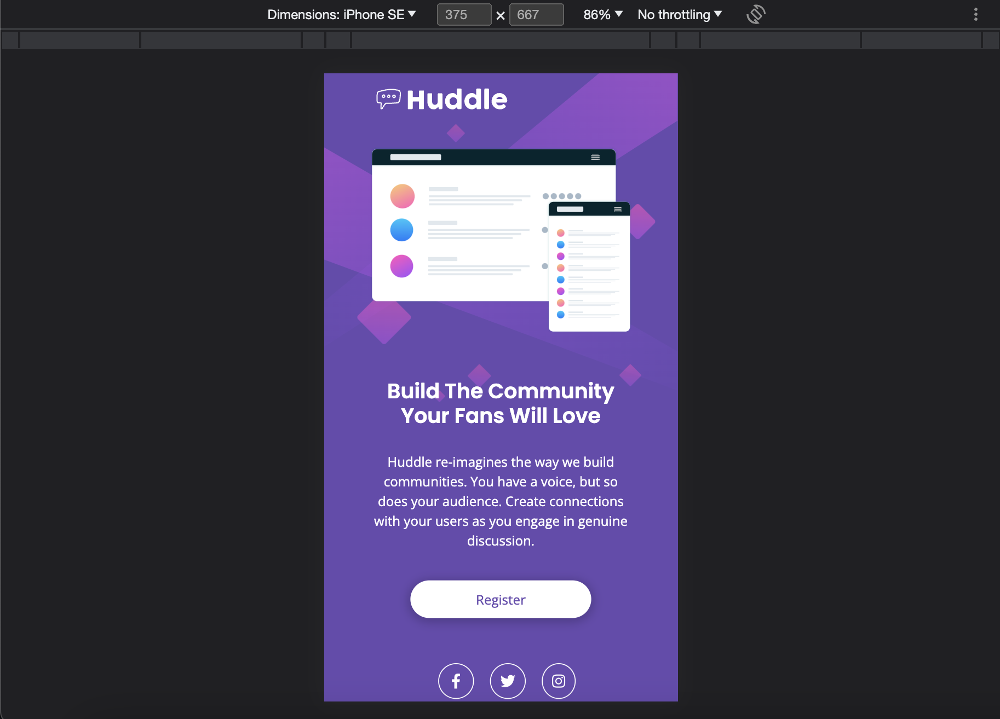

# Frontend Mentor - Huddle landing page with single introductory section solution

This is a solution to the [Huddle landing page with single introductory section challenge on Frontend Mentor](https://www.frontendmentor.io/challenges/huddle-landing-page-with-a-single-introductory-section-B_2Wvxgi0). Frontend Mentor challenges help you improve your coding skills by building realistic projects. 

## Table of contents

- [Overview](#overview)
  - [The challenge](#the-challenge)
  - [Screenshot](#screenshot)
  - [Links](#links)
- [My process](#my-process)
  - [Built with](#built-with)
  - [What I learned](#what-i-learned)
  - [Useful resources](#useful-resources)
- [Author](#author)
- [Acknowledgments](#acknowledgments)

## Overview
### The challenge
Users should be able to:
- View the optimal layout for the page depending on their device's screen size
- See hover states for all interactive elements on the page

### Screenshot




### Links
- Live Site URL: https://yacodingroom.github.io/huddle-landing-page/

## My process
### Built with
- Semantic HTML5 markup
- CSS custom properties
- Bootstrap
- Flexbox

### What I learned
Bootstrap img-fluid

```html

```
```css
.img-fluid {
    max-width: 100%;
    height: auto;
}
```

### Useful resources
- [Responsive images](https://getbootstrap.com/docs/5.3/content/images/#responsive-images)
讓圖片可以隨著父元素寬度伸縮自如。

## Author
- Frontend Mentor - [@YAcodingroom]
(https://www.frontendmentor.io/profile/YAcodingroom)
- Threads - [@nt19_lya](https://www.threads.net/@nt19_lya)

## Acknowledgments
感謝Ivy&Ciao，感謝Angela老師，感謝靜文老師，感謝Google，感謝Bootstrap，感謝宇宙，感謝自己。
